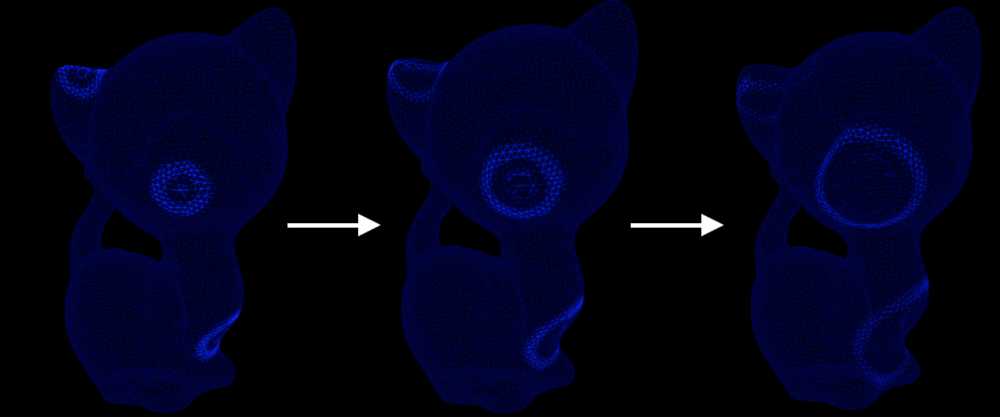

# Wave
The wave equation f_tt = a∆f - bf_t, like the diffusion equation, describes how a function f changes over time by a scalar coefficient a times its spatial laplacian. Here 1 / sqrt(a) is the speed of the wave and b is a dampening factor. f itself could represent a color or height field prescribed at the mesh vertices. This repo discretizes a wave equation with implicit time stepping scheme. 

Note: Requires Eigen 3.2.4 and assumes it is in /usr/local/Cellar/eigen/3.2.4/include/eigen3/
